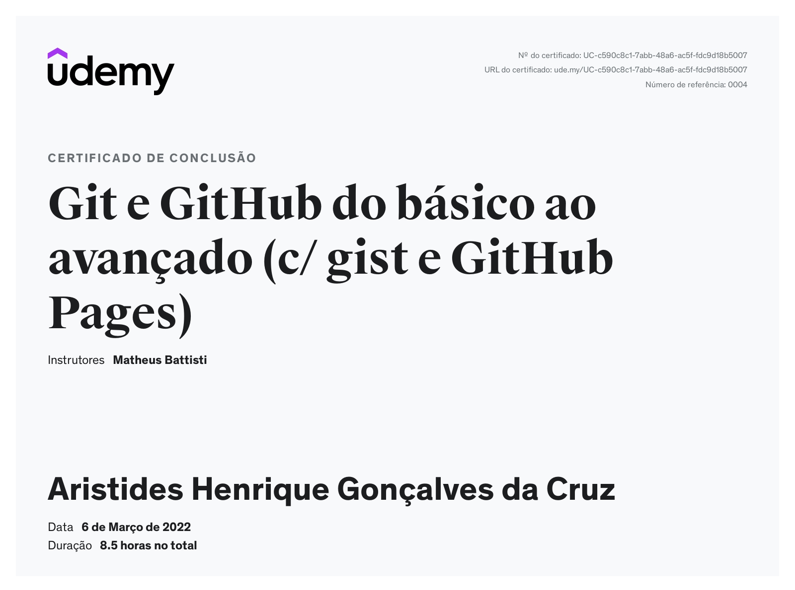

# Sprint 1 - git/github/linux

#### Ferramentas de versionamento de código são essenciais para o sucesso de projetos que envolvem código. Atualmente o Git é padrão de mercado, sendo amplamente utilizado em projetos de dados. Não menos importantes são os sistemas operacionais baseados em Linux, cujo conhecimento dos princípios básicos de operação e comandos de terminal mais comuns são necessários a qualquer profissional da área de Data & Analytics.

## Exercícios:

[Execício 1](./exercicios/ex_1.md)

[Execício 2](./exercicios/ex_1.md)

[Execício 3](./exercicios/ex_1.md)

[Execício 4](./exercicios/ex_1.md)

[Certificado Git e GitHub](./certificados/git_github.jpg)

# Olá meu nome é Aristides Henrique

#### 🏡Cidade: [Matozinhos/MG](https://www.google.com.br/maps/place/Matozinhos,+MG,+35720-000/@-19.565346,-44.0787083,14z/data=!4m16!1m9!3m8!1s0xa66723aaf221c1:0x353133ecd20eaa0d!2sMatozinhos,+MG,+35720-000!3b1!8m2!3d-19.565346!4d-44.0787083!10e5!16s%2Fg%2F11bxg16tkc!3m5!1s0xa66723aaf221c1:0x353133ecd20eaa0d!8m2!3d-19.565346!4d-44.0787083!16s%2Fg%2F11bxg16tkc?entry=ttu)
#### 🏫Instituição de ensino: [PUC Minas São Gabriel](https://www.pucminas.br/unidade/sao-gabriel/Paginas/default.aspx)
#### 👨‍🎓Curso e semestre atual: Sistemas de Informação (atualmente vim da universidade UNA - Aimorés e estava no 4º semestre)

## Experiências na área de tecnologia:

Engenheiro de Dados apaixonado pela tecnologia e focado em soluções baseadas na AWS, atualmente trabalho nessa área enquanto estudo Sistemas de Informação na PUC Minas. Fui líder discente na Business Lab 2022 pela UNA CDU, o que reforçou meu compromisso com o aprendizado contínuo e a busca por desafios.

Durante minha trajetória como desenvolvedor, mergulhei no universo da programação, com ênfase em Python, uma linguagem que me fascina pela sua versatilidade e poder, especialmente em relação a processos ETL. No entanto, estou aberto a aprender novas tecnologias e explorar diferentes abordagens para resolver problemas complexos, pois acredito na importância de estar atualizado e adaptável às demandas em constante evolução.

Além de minha paixão pela tecnologia, tenho interesses além do mundo digital. Sou uma pessoa extrovertida, que valoriza a colaboração e o compartilhamento de conhecimentos. Atuar como monitor em minha empresa, auxiliando estagiários e profissionais em seu crescimento, é algo que me traz grande satisfação. Acredito no trabalho em equipe e na comunicação contínua como fundamentais para alcançar resultados excepcionais.

## Hobbies

Fora do ambiente profissional, desfruto de momentos de lazer jogando jogos de tabuleiro 🕹️🧩, uma atividade que estimula a estratégia e o trabalho em equipe. Além disso, estou empenhado em aprimorar minhas habilidades linguísticas e estou ativamente aprendendo inglês.

Gosto de assistir animes, documentários científicos, acompanho um canal no youtube chamado [mano deyvin](https://www.youtube.com/@manodeyvin) 👑 O rei do chorume da bolha tech 🤣🤣, filmes do [Mazzaropi](https://pt.wikipedia.org/wiki/Am%C3%A1cio_Mazzaropi) com a cultura e frases engraçadas kkkk 🤣, e por fim séries como [Prison Break](https://www.primevideo.com/detail/amzn1.dv.gti.74b32d48-e785-caa6-44b8-aeb55043150b?ref_=dvm_pds_tit_br_dc_s_g_mkw_sc2wmAzbM-dc_pcrid_607089033054&mrntrk=slid__pgrid_124213213644_pgeo_9074167_x__adext__ptid_kwd-971285368&gclid=Cj0KCQjw2eilBhCCARIsAG0Pf8sPUmq6Lunm1U-TC1ftsYV0S5m0YvO12s19iWC970VZLWP-pInqDAsaAsnHEALw_wcB).

## Fatos engraçados sobre mim:

Como eu era conhecido como o "garoto da tecnologia" no meu bairro, frequentemente me pediam para consertar não apenas computadores, mas também coisas inusitadas, como liquidificadores, máquinas de lavar, portões elétricos e qualquer coisa que dependesse de energia, haha.

Na escola, sempre que alguma professora ou funcionário tinha problemas com o computador, me chamavam para tentar arrumar. Foi nessa época que tive meu primeiro contato com o computador, ao experimentar jogar um emulador de GBA (Game Boy Advance), no qual consegui juntar dinheiro suficiente para comprar um disquete de 3,5 polegadas, com impressionantes 1.44 MB de capacidade, o suficiente para armazenar o emulador e o save do jogo.

A única forma de acesso à internet naquela época era através da internet discada ou indo à biblioteca da cidade. Bons tempos aqueles...